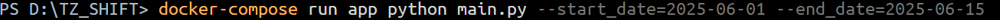
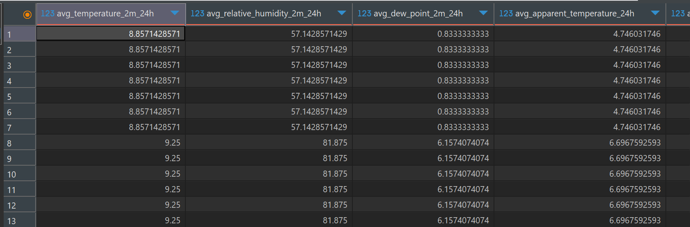
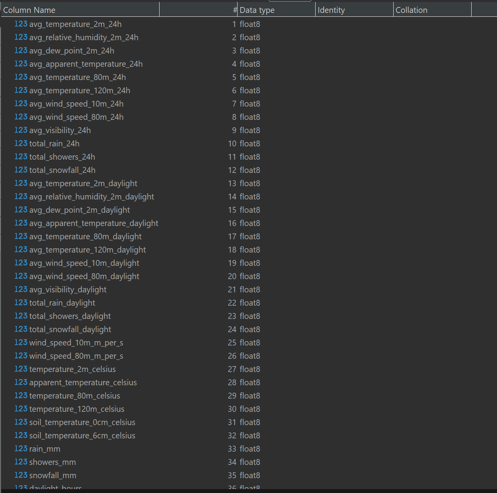

# TZ_SHIFT — ETL

Проект предназначен для выполнения ETL-задач по команде с заданными параметрами дат. Реализует получение данных с API, обработку данных и загрузку в базу PostgreSQL.

## 🚀 Как выполнять команды

Для запуска ETL вручную

```
docker-compose run --rm app python main.py --start_date=2023-01-01 --end_date=2023-01-05
```

---

## База данных

Проект использует PostgreSQL.

*Скриншот терминала:*




*Скрин таблицы в DBeaver:*



*Скрин столбцов в DBeaver:*



